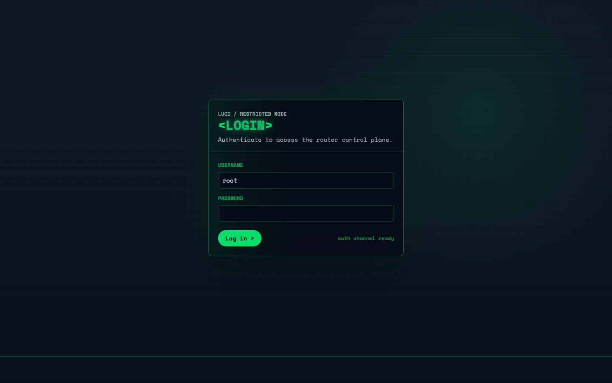
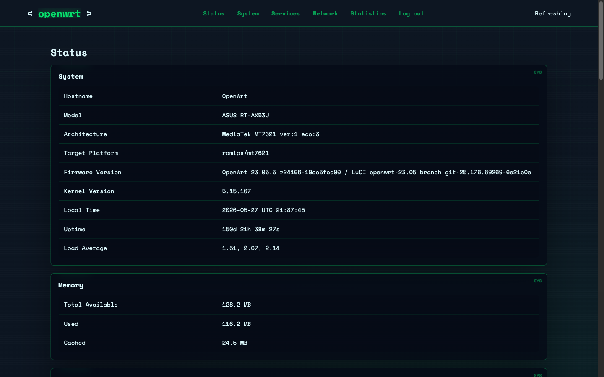

# luci-theme-neonwrt

NeonWrt is a cyber-terminal LuCI theme for OpenWrt. It uses a dark grid surface, Space Mono typography, neon green accents, and compact router-first layouts for status, network, service, and system pages.

The package is pure LuCI template, CSS, and JavaScript, so it is architecture-independent and is released as an `Architecture: all` OpenWrt package.

## Preview

### Login



### Status Overview



## Install

Download `luci-theme-neonwrt-all.ipk` from the latest GitHub Release, then upload it in LuCI:

`System -> Software -> Upload Package`

Or install it from SSH:

```sh
scp luci-theme-neonwrt-all.ipk root@192.168.1.1:/tmp/
ssh root@192.168.1.1
opkg install /tmp/luci-theme-neonwrt-all.ipk
```

The post-install script registers the theme and switches LuCI to:

```sh
/luci-static/neonwrt
```

The package does not ship `/etc/config/*` files, so it will not overwrite router network, system, DHCP, wireless, or service configuration.

## Release Package

The release asset is:

```text
luci-theme-neonwrt-all.ipk
```

Package metadata:

```text
Package: luci-theme-neonwrt
Architecture: all
```

`Architecture: all` is intentional. NeonWrt contains no compiled binaries, so the same package can be installed on OpenWrt devices across CPU architectures such as MIPS, ARM, AArch64, and x86_64.

## Automated Releases

GitHub Actions builds releases from `VERSION`.

Release workflow:

1. Read `VERSION`.
2. Validate the theme scaffold.
3. Build a clean OpenWrt `.ipk`.
4. Refuse to release if router config files are present.
5. Create a `vX.Y.Z` tag.
6. Publish a GitHub Release with `Bug Fixes` and `Features` sections.
7. Upload `luci-theme-neonwrt-all.ipk` and its SHA-256 file.

Conventional commits are used for release notes:

```text
feat: add dashboard panel
fix: improve firewall table spacing
```

## Local Development

Install dependencies:

```sh
npm install
```

Run the local preview:

```sh
npm run dev
```

Validate and package:

```sh
npm run build
npm run package:theme
```

Generated files are written to `dist/`, which is intentionally ignored by Git.

## Project Layout

```text
luci-theme-neonwrt/
  Makefile
  root/www/luci-static/neonwrt/
  root/usr/share/ucode/luci/template/themes/neonwrt/
  luasrc/view/themes/neonwrt/

scripts/
  package-theme.mjs
  validate-theme.mjs

.github/workflows/
  release.yml
```

## OpenWrt SDK

To build inside an OpenWrt SDK, copy or symlink `luci-theme-neonwrt` into a package feed, then run:

```sh
make package/luci-theme-neonwrt/compile V=s
```

For the local helper script:

```sh
scripts/build-in-sdk.sh /path/to/openwrt-sdk
```

## License

See [LICENSE](LICENSE).
